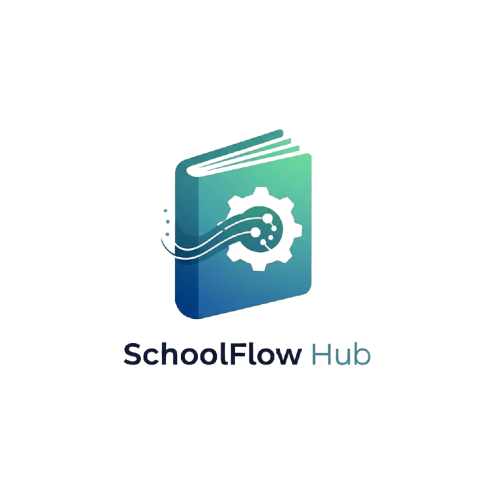

# SchoolFlow Hub

A comprehensive school management system built with modern web technologies. SchoolFlow Hub provides an intuitive dashboard for managing students, teachers, courses, attendance, exams, and more.



## Table of Contents

- [Features](#features)
- [Architecture](#architecture)
- [Technology Stack](#technology-stack)
- [Prerequisites](#prerequisites)
- [Installation](#installation)
- [Configuration](#configuration)
- [Running the Application](#running-the-application)
- [Admin Setup](#admin-setup)
- [Usage](#usage)
- [Project Structure](#project-structure)
- [Security](#security)
- [Development](#development)
- [Testing](#testing)
- [Deployment](#deployment)
- [Contributing](#contributing)
- [License](#license)
- [Support](#support)

## Features

SchoolFlow Hub offers a complete suite of school management tools:

- **User Authentication**: Secure login system for administrators
- **Dashboard Overview**: At-a-glance statistics and visualizations
- **Student Management**: Add, edit, and track student information
- **Teacher Management**: Maintain teacher records and assignments
- **Course Management**: Create and manage course offerings
- **Attendance Tracking**: Record and monitor student attendance
- **Exam Management**: Track exam records and scores
- **Announcements**: Publish important school-wide messages
- **Reporting & Analytics**: Generate reports and visualize data
- **Season Management**: Academic year/term tracking
- **Graduation Eligibility**: Automatic eligibility checking
- **Bulk Data Operations**: Import/export student data via CSV/JSON
- **Responsive Design**: Works on desktops, tablets, and mobile devices

## Architecture

SchoolFlow Hub follows a client-server architecture with a static frontend and backend services:

```
┌─────────────────┐    ┌──────────────────┐    ┌─────────────────┐
│   Web Browser   │◄──►│  Static Server   │◄──►│  Back4App API   │
└─────────────────┘    └──────────────────┘    └─────────────────┘
                              │                        │
                              ▼                        ▼
                       ┌─────────────┐         ┌──────────────┐
                       │   Files     │         │   Database   │
                       │ (HTML/CSS/  │         │  (MongoDB)   │
                       │ JavaScript) │         │              │
                       └─────────────┘         └──────────────┘
```

The frontend is built with vanilla JavaScript and communicates with the Back4App backend through the Parse SDK.

## Technology Stack

- **Frontend**: HTML5, CSS3, JavaScript (ES6+ modules)
- **Backend**: Back4App (Parse Server)
- **Database**: MongoDB
- **Authentication**: Parse User Authentication
- **Charts**: Chart.js
- **Icons**: FontAwesome
- **Server**: Node.js HTTP Server
- **Package Manager**: npm

## Prerequisites

Before you begin, ensure you have the following installed:

- Node.js (version 14 or higher)
- npm (comes with Node.js)
- A modern web browser
- Internet connection

## Installation

1. Clone the repository:
   ```bash
   git clone <repository-url>
   cd SchoolFlow-Hub
   ```

2. Install dependencies:
   ```bash
   npm install
   ```

## Configuration

The application requires environment variables for Back4App integration. Create a `.env` file in the project root:

```env
BACK4APP_APP_ID=your_app_id
BACK4APP_JS_KEY=your_javascript_key
BACK4APP_MASTER_KEY=your_master_key
BACK4APP_SERVER_URL=https://parseapi.back4app.com/
ADMIN_USERNAME=admin
ADMIN_EMAIL=admin@schoolflow.com
ADMIN_PASSWORD=your_secure_password
```

Refer to the [Admin Setup](#admin-setup) section for detailed configuration instructions.

## Running the Application

Start the development server:

```bash
npm start
```

By default, the server runs on `http://localhost:8000`. Open this URL in your browser to access the application.

To use a different port, modify the `PORT` variable in `server.js`.

## Admin Setup

For detailed instructions on setting up the admin user and configuring Back4App permissions, see [README-ADMIN.md](README-ADMIN.md).

Key steps include:
1. Configure environment variables in `.env`
2. Run `npm run create-admin` to create the admin user
3. Configure Back4App Class Level Permissions in the dashboard

## Usage

1. **Login**: Access the application at `http://localhost:8000` and log in with your admin credentials
2. **Navigate**: Use the sidebar to access different management sections
3. **Add Data**: Use the forms in each section to add new records
4. **View Reports**: Check the Dashboard and Reports sections for analytics
5. **Export Data**: Use the export buttons to download CSV/PDF reports

## Project Structure

```
SchoolFlow-Hub/
├── js/                  # Modular JavaScript components
│   ├── studentManager.js
│   ├── teacherManager.js
│   ├── courseManager.js
│   ├── examManager.js
│   ├── attendanceManager.js
│   ├── seasonManager.js
│   └── utils.js
├── scripts/             # Setup and utility scripts
│   ├── createAdminUser.js
│   └── test-parse-connection.js
├── tests/               # Test files
├── dashboard.html       # Main application interface
├── dashboard.css        # Main application styling
├── dashboard.js         # Main application logic
├── loginPage.html       # Login interface
├── loginPage.css        # Login page styling
├── login.js             # Login page logic
├── server.js            # Static file server
├── package.json         # Project dependencies and scripts
├── .env                 # Environment variables (git-ignored)
├── .gitignore           # Git ignore patterns
└── README.md            # This file
```

## Security

SchoolFlow Hub implements several security measures:

- **Environment Variables**: Sensitive credentials stored in `.env` (git-ignored)
- **Parse Authentication**: Secure user authentication with session management
- **Access Control**: Role-based permissions via Back4App
- **Input Validation**: Client and server-side data validation
- **Secure Communication**: HTTPS communication with Back4App

See [README-ADMIN.md](README-ADMIN.md) for detailed security guidelines.

## Development

### Code Structure

The application is organized into modular components:

- **Dashboard**: Main application interface with tabbed navigation
- **Managers**: Separate modules for handling different data types (students, teachers, etc.)
- **Utilities**: Shared helper functions
- **UI Components**: Reusable interface elements

### Adding New Features

1. Create a new section in `dashboard.html`
2. Add corresponding CSS in `dashboard.css`
3. Implement functionality in `dashboard.js` or create a new manager
4. Update navigation in the sidebar

### Coding Standards

- Use consistent indentation (2 spaces)
- Follow existing naming conventions
- Comment complex logic
- Maintain responsive design principles

## Testing

The project includes several test utilities:

- `test-back4app.html`: Connection testing
- `test-simple-crud.js`: Basic CRUD operations
- `test-crud-operations.js`: Comprehensive CRUD testing
- `check-all-students.js`: Data validation

Run tests with:
```bash
node test-simple-crud.js
```

## Deployment

### Local Deployment

1. Follow the [Installation](#installation) instructions
2. Configure environment variables
3. Run `npm start` to start the server

### Production Deployment

For production deployment:

1. Host static files on a web server
2. Ensure environment variables are properly configured
3. Set up proper SSL certificates
4. Configure Back4App production environment

## Contributing

We welcome contributions to SchoolFlow Hub! To contribute:

1. Fork the repository
2. Create a feature branch
3. Commit your changes
4. Push to the branch
5. Create a Pull Request

Please ensure your code follows the existing style and includes appropriate tests.

## License

This project is licensed under the MIT License - see the [LICENSE](LICENSE) file for details.

## Support

For support, please:

1. Check the documentation in this README
2. Review [README-ADMIN.md](README-ADMIN.md) for admin setup
3. Open an issue on the GitHub repository
4. Contact the development team

---

*SchoolFlow Hub - Streamlining school administration, one student at a time.*